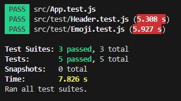

# Emoji Search App
This project is a part of [Patika](https://www.patika.dev/tr/programs) Fimple React Bootcamp.
## Assignment Requirements
- Writing test codes for existing [Emoji Search](https://github.com/andrewagain/emoji-search) project in React own documentation.
    1. Testing if the header component is rendered succesfully
    2. Testing if the initial emoji list is rendered succesfully
    3. Testingif  the emoji list is rendered succesfully after filtering for searching
    4. Testing if copy is works when clicking one of the emojis
    
[Assignment Link](https://academy.patika.dev/tr/courses/react/odev5)
## Test Result
 

Created with *create-react-app*. See the [full create-react-app guide](https://github.com/facebookincubator/create-react-app/blob/master/packages/react-scripts/template/README.md).
## Install
`npm install`
## Usage
`npm start`
